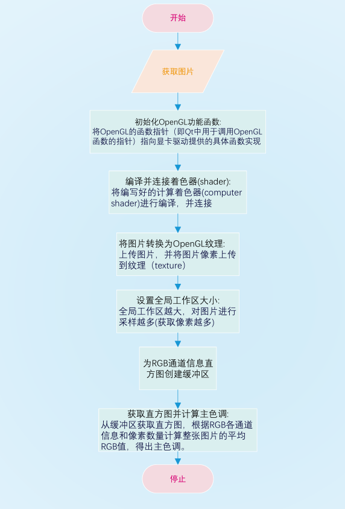

# 技术文档.md

**文档跳转**

[测试文档](./测试文档.pdf)

[演示视频](../项目演示视频.mp4)

[开发日志](./开发日志.md)

### 项目完成情况表

| 项目要求                                               | 实现情况                                       |
| :----------------------------------------------------- | ---------------------------------------------- |
| 输入一张图片，程序输出一个它主色调的RGB颜色值          | 完成                                           |
| 必须使用 Qt 完成目标                                   | 完成                                           |
| 使用计算着色器(compute shader)完成计算                 | 完成                                           |
| 必须使用 Qt 完成目标，并且计算过程必须在 GPU 内执行    | 完成                                           |
| （拓展功能）提供用户交互界面(上传图片及显示主色调信息) | 完成                                           |
| 使用 Qt RHI 提供的接口                                 | 未完成，使用的是QT中内置的OpenGL模块进行开发。 |

# 一、赛题题目

## 1.1 项目名称

使用Qt RHI的接口，实现计算给定图片的主色调。

## 1.2 项目描述

输入数据为png或jpg格式的图片，通过使用 Qt RHI 提供的计算 shader 的支持，在着色器中计算出输入图片中的主颜色（即被大范围使用的颜色区间），程序输出一个 RGB 颜色值

使用 Qt6.6版本
无需精准判断颜色，比如一张图片上有 25%的部分用了纯红色，25%的部分用了稍微淡一点的红色，剩下50%是丰富多彩的其它颜色，则输出的颜色可以处于纯红色和淡红色之间（比如进行加权平均计算）

## 1.3 项目要求

必须使用 Qt 完成目标，并且计算过程必须在 GPU 内执行，对 CPU 的消耗可以忽略不计。

## 1.4 预期目标

输入为一个图片路径，输出为一个 ARGB 的颜色值。

# 二、题目分析与设计

## 2.1 赛题分析

根据题目给出的要求以及提示，经过组内成员讨论，决定采用**加权平均计算**方法对图片的主色调进行计算。

**加权平均计算：**统计图片中所有像素点的RGBA的值以及采样的像素点个数，将RGBA各自累加，最后各自除以像素点个数，得到每个颜色通道的平均强度（或平均值）。这个RGBA平均值就是最终结果。

基于以上分析，有以下关注点:

**使用CPU进行像素点采集:**设定步长，遍历整张图片的像素点，将其RGBA信息累加到统计直方图中，记录遍历的像素点个数，最后RGBA除以像素点个数得到各颜色通道的平均强度。

**使用GPU进行像素点采集:**利用GPU并行计算的高效率优势，使用OpenGL4.3开始支持的计算着色器(compute shader)，设置工作区，并行地将各像素点的RGBA信息累加到统计直方图中，记录遍历的像素点个数，最后RGBA除以像素点个数得到各颜色通道的平均强度。

然而，题目明确要求计算必须在GPU内执行，不能使用CPU进行像素点采集。

## 2.2 流程设计

经过多番文档查询以及计算机图形学相关知识的学习，最终得出计算的流程:

# 三、使用GPU计算图片主色调的具体实现

## 3.1 准备工作

### 3.1.1 需要具备的相关知识

#### QT6.6

QT6.6基础

- 了解QT6.6的基本架构和特性，包括其图形处理功能。
- 熟悉QT6.6的API和类库，特别是与图形和图像处理相关的部分。

#### 图像处理基础

1. 图像格式与编码
   - 了解常见的图像格式（如JPEG、PNG等）及其编码方式。
   - 熟悉图像的色彩空间（如RGB、YUV等）和色彩深度。
2. 图像像素操作
   - 掌握图像像素的读取和写入方法。
   - 了解如何遍历图像的像素点，并获取其颜色值。

#### GPU并行计算

1. GPU架构与原理
   - 熟悉GPU的基本架构和工作原理，包括其流处理器（Stream Processor）和内存架构。
   - 了解GPU如何执行并行计算任务，并优化其性能。
2. CUDA或OpenGL编程
   - 掌握CUDA或OpenGL等GPU编程框架的基本概念和编程方法。
   - 熟悉如何将图像处理任务映射到GPU上，并编写相应的并行计算代码。

#### 主色调计算

1. 主色调定义
   - 明确主色调（或平均色）的定义，即图像中所有像素颜色的平均值。
2. 计算方法
   - 了解如何在图像上均匀分布采样点，并获取其颜色值。
   - 掌握如何计算采样点的颜色平均值，得到主色调。

## 3.2 流程各步骤的具体实现

### 3.2.1 交互界面中用户上传图片

`QString filename = QFileDialog::getOpenFileName(this,tr("Open Image"),QDir::homePath(),tr("Images (*.jpg *.bmp *.png)")); // 修改文件过滤器   qDebug() << "filename:" << filename;   QImage image(filename); // 图片初始化   if(image.isNull())qDebug()<<"图片加载失败";else{qDebug()<<"图片加载成功:"<<image;openGLWidget->CsImage = image;//赋给全局图片变量       ui->selectedPicture->setPixmap(QPixmap::fromImage(image));`
    }`

### 3.2.2 初始化OpenGL函数

`//初始化OpenGL函数，将这些OpenGL的函数指针（即Qt中用于调用OpenGL函数的指针）指向显卡驱动提供的具体函数实现
    initializeOpenGLFunctions();`

### 3.2.3 编译并且连接着色器

`// 加载并编译着色器
    if (!shaderProgram.addShaderFromSourceFile(QOpenGLShader::Compute, ":/compute_shader.comp")) {
        qWarning() << "Fail complie:" << shaderProgram.log();
        return;
    }
    // 连接着色器
    if (!shaderProgram.link()) {
        qWarning() << "fail link:" << shaderProgram.log();
        return;
    }`

### 3.2.4 计算着色器的编写

`#version 450`
layout(local_size_x = 1, local_size_y = 1) in;
`layout(rgba8, binding = 0) uniform image2D img;`
`layout(std430, binding = 1) buffer Histogram {`
    `uint histogram[256 * 3]; //一个足够大的数组`
`};`
`void main() {`
    `ivec2 coords = ivec2(gl_GlobalInvocationID.x,gl_GlobalInvocationID.y);`
    `vec4 color = imageLoad(img, coords);`
        `uint r = uint(color.r * 255.0);`
        `uint g = uint(color.g * 255.0);`
        `uint b = uint(color.b * 255.0);`
        `uint a = uint(color.a * 255.0);`
        `atomicAdd(histogram[0], r);`
        `atomicAdd(histogram[1], g);`
        `atomicAdd(histogram[2], b);`
        `atomicAdd(histogram[3], a);`
        `atomicAdd(histogram[4], 1);`
`}`

### 3.2.5 将图片转换为OpenGL纹理

`//加载图片
    QImage image=CsImage;
    if(image.isNull())qDebug()<<"图片加载失败";
    else qDebug()<<"图片加载成功:"<<image;
    // 创建一个 QOpenGLTexture 对象
    GLuint uTexture[2];
    // 将 QImage 转换为 OpenGL 纹理
    glGenTextures(1, &uTexture[0]);
    glBindTexture(GL_TEXTURE_2D, uTexture[0]);
    glTexParameteri(GL_TEXTURE_2D, GL_TEXTURE_WRAP_S, GL_REPEAT);
    glTexParameteri(GL_TEXTURE_2D, GL_TEXTURE_WRAP_T, GL_REPEAT);
    glTexParameteri(GL_TEXTURE_2D, GL_TEXTURE_MAG_FILTER, GL_LINEAR);
    glTexParameteri(GL_TEXTURE_2D, GL_TEXTURE_MIN_FILTER, GL_LINEAR);
    // 上传图像数据到纹理
    glTexImage2D(GL_TEXTURE_2D, 0, GL_RGBA, image.width(), image.height(), 0, GL_RGBA, GL_UNSIGNED_BYTE, image.bits());
    glBindImageTexture(0, uTexture[0], 0, GL_FALSE, 0, GL_READ_ONLY, GL_RGBA8);`

### 3.2.6 创建供CPU与GPU数据交换的缓冲区

`//创建缓冲区指针SSBO
    QOpenGLBuffer ssbo;
    ssbo.create();
    ssbo.bind();
    ssbo.allocate(256 * 3 * sizeof(GLuint)); // 为 RGB 直方图分配空间
    // 准备要写入缓冲区的数据
    std::vector<GLuint> initialData(256 * 3, 0); // 初始化所有值为0的向量
    // 将空数据写入缓冲区 否则再次对缓冲区数据进行访问时 数据会积累
    ssbo.write(0, initialData.data(), initialData.size() * sizeof(GLuint));
    // 绑定 SSBO 到正确的绑定点 binding=1(.comp)
    glBindBufferBase(GL_SHADER_STORAGE_BUFFER, 1, ssbo.bufferId());`

### 3.2.7 设置工作区大小并启动工作区

`//绑定着色器并启用纹理
    shaderProgram.bind();
    // 设置工作区大小 越大 进行采样越多
    int workGroupsX = image.width()/1; //全局工作区大小为 图片尺寸/局部工作区大小
    int workGroupsY = image.height()/1;
    glDispatchCompute(workGroupsX, workGroupsY, 1);
    //确保计算完成
    glMemoryBarrier(GL_SHADER_STORAGE_BARRIER_BIT);`

### 3.2.8 读回直方图数据(RGBA各通道的累加值)

`// 从缓冲区读回直方图数据
    ssbo.bind();
    GLuint *histogramData = static_cast<GLuint*>(ssbo.map(QOpenGLBuffer::ReadOnly));
    GLuint redCount = 0;
    GLuint greenCount = 0;
    GLuint blueCount =  0;
    GLuint alphaCount=0;
    GLuint totalCount = 0;
    if (histogramData) {
        qDebug()<<"读取直方图成功";
        // 找到R、G、B通道的主色调
        redCount = histogramData[0];
        greenCount =histogramData[1];
        blueCount = histogramData[2];
        alphaCount = histogramData[3];
        totalCount = histogramData[4];
    }`

### 3.2.9 处理数据并计算出主色调颜色信息

`QColor mainColor;
    int b_scaled = static_cast<int>((1.2 * b) / t); // 确保结果是一个整数
    int g_scaled = static_cast<int>((1.2 * g) / t);
    int r_scaled = static_cast<int>((1.2 * r) / t);
    int a_scaled = static_cast<int>((1.2 * a) / t);
    // 确保每个分量都在 0 到 255 之间
    b_scaled = qBound(0, b_scaled, 255);
    g_scaled = qBound(0, g_scaled, 255);
    r_scaled = qBound(0, r_scaled, 255);
    a_scaled = qBound(0, a_scaled, 255);
    // 使用 QRgb 来组合颜色分量 (r_scaled和b_scaled互换位置)
    QRgb rgba = qRgba(b_scaled, g_scaled, r_scaled, a_scaled);
    //设置颜色
    mainColor.setRgba(rgba);
    qDebug()<<"mainColor"<<mainColor;
    CsColor = mainColor;`

### 3.2.10 善后工作

`// 清理工作
    ssbo.unmap(); // 确保在销毁SSBO之前已经解映射
    shaderProgram.release(); // 解绑着色器程序
    glDeleteTextures(1, uTexture); // 删除纹理对象`

# 四、难点、解决方法及做出的妥协

## **4.1 难点及解决方法**

**（1）GPU计算时，各工作区采样像素点信息时，对直方图的竞态访问。**

**解决方法:**使用原子计算(原子操作指的是该操作在执行过程中不会被其他线程或进程打断，从而保证了操作的完整性和线程安全性。在并发环境中，多个线程可能同时访问和修改同一个变量，导致数据竞争和不一致的问题。而atomicAdd函数通过硬件级别的原子指令实现，确保了在执行加法操作的过程中，其他线程无法访问或修改该变量的值，从而避免了数据竞争和不一致的问题。)。OpenGL compute shader中提供的atomicAdd函数能够很好地帮助解决工作区对直方图的竞态访问问题。

该技术在本项目中的运用:

`atomicAdd(histogram[0], r);
        atomicAdd(histogram[1], g);
        atomicAdd(histogram[2], b);
        atomicAdd(histogram[3], a);
        atomicAdd(histogram[4], 1);`

## **4.3 难点与妥协**

QT RHI（Rendering Hardware Interface）是Qt6中引入的一个新的图形接口，缺少先前案例与社区支持，初学者在学习过程中寸步难行，使用官方文档作为参考，开发进展缓慢，问题频出。

QT RHI对OpenGL、Vulkan、DirectX、Metal等图形API进行了封装和抽象，由于RHI使用困难，项目开发将直接使用QT内置的OpenGL。

# 五、总结与未来展望

## 5.1 总结

我们基于QT6.6内置的相关图形处理接口实现了：通过GPU对一张图片的主色调进行计算的功能。通过对图片的各像素点进行RGBA信息统计，做加权平均计算得出这张图片的主色调。实现过程中查阅了大量文档以及博客，在项目开发中掌握了基本的计算机图形学知识以及QT的使用，提高了工程能力。最后，经过测试，主色调计算精度达到要求标准（测试详情见[测试文档](./测试文档.pdf)）。

## 5.2 未来展望

在未来工作中，我们将继续致力于优化该功能，以下是几点可能的方向:

**1.优化主色调计算方法：**加权平均计算是一个较通用的主色调计算方法，但也许还存在着其它更加适合该功能应用场景的计算方法。

**2.更合理地配置工作区大小：**工作区设置得太大，会导致采样数过多，虽然精度可能会提高，但对性能可能有影响，最坏的情况会导致直方图存储不够用。

**3.全面采用RHI接口：**由于RHI的社区支持和样例不足，本项目开发直接使用了QT内置的OpenGL进行功能实现。未来等待社区支持和生态更加成熟后，考虑将OpenGL的接口替换成RHI接口。

**参考文档:**

qt6.6: [Qt 6.6 Release - Qt Wiki](https://wiki.qt.io/Qt_6.6_Release)

qt-6RHI:  https://doc.qt.io/qt-6/qrhi.html
OpenGL4.5 使用指南: [OpenGL 4 Reference Pages](https://registry.khronos.org/OpenGL-Refpages/gl4/)

Vulkan：[Vulkan Documentation :: Vulkan Documentation Project](https://docs.vulkan.org/spec/latest/index.html)

**参考博客:**

[Qt实现简单项目——打开图片_qt 打开图片-CSDN博客](https://blog.csdn.net/DXuexue/article/details/119830522)

[Qt获取一张图片的平均色（主色调） - Maicss - 博客园](https://www.cnblogs.com/maicss/p/14715453.html)

[QtOpenGL入门教程（一）—— 图形渲染管线 - 哔哩哔哩](https://www.bilibili.com/opus/505012695739377731)

[OpenGL（QT平台）学习与实战（四）_qt glcreateshader-CSDN博客](https://blog.csdn.net/m0_38144614/article/details/120783620)

[OpenGL 之 Compute Shader（通用计算并行加速） - 茶飘香~ - 博客园](https://www.cnblogs.com/chen9510/p/12000320.html)

[OpenGL之计算着色器(Compute Shader)注解_glbindimagetexture-CSDN博客](https://blog.csdn.net/What_can_you_do/article/details/125623489)

[RGB图转化成灰度图的色彩权重（不同精度等级）_rgb转灰度图三通道权重-CSDN博客](https://blog.csdn.net/qq_33810188/article/details/81587829)
